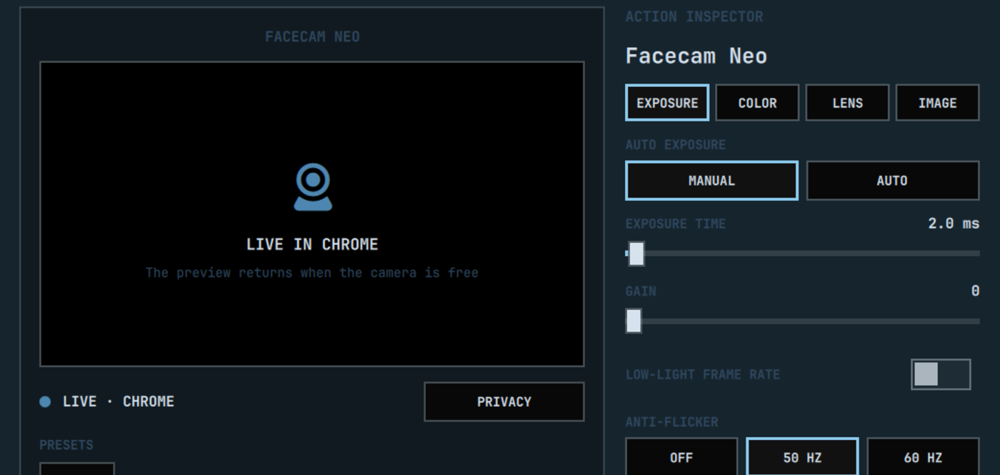

# Elgato Control for Omarchy

An unofficial native Omarchy Shell plugin for controlling supported Elgato
hardware on Linux without the Elgato desktop application.

Current version: **0.3.1**

## Supported hardware

- Stream Deck Plus (`0fd9:0084`): eight keys, four dials, 120×120 JPEG artwork, device brightness, and an 800×100 live dial LCD
- Stream Deck Pedal (`0fd9:0086`): three pedal events
- Elgato Key Light Neo: automatic mDNS discovery, grouped power, brightness, temperature, and live status
- Wave:3: automatic PipeWire detection; microphone actions target the detected Wave source rather than an unrelated default microphone
- Facecam Neo (`0fd9:0081`): picture settings, a privacy switch, saved looks, a live preview, and whether an app is using the camera (other Facecam models are found by name and use the same standard controls, but are untested)
- Elgato bar icon and a visual configuration editor that applies changes at runtime

The panel is capability-driven: Plus-only LCD/dial controls, Pedal mappings,
Wave controls, Facecam controls, and Key Lights are shown only when the
relevant hardware is detected.

## Screenshots

### Stream Deck Plus


### Stream Deck Pedal


### Wave:3


### Facecam Neo



### Key Lights


See [DEVELOPMENT_STATUS.md](DEVELOPMENT_STATUS.md) for the implementation history, verified hardware, architecture, and remaining work.

## Installation

Install directly with Omarchy:

```bash
omarchy plugin add https://github.com/amitcpatel/omarchy-elgato-control --enable
```

The first run creates `~/.config/elgato-control/profile.json`. Existing
`~/.config/omarchy-streamdeck/profile.json` mappings are migrated automatically. Use the
Elgato Control panel to configure keys, dials, and pedals. Changes and artwork
apply automatically.

### Requirements

- Omarchy 4 with Python 3
- `libhidapi-hidraw` for Stream Deck and Pedal hardware
- ImageMagick for generated application artwork and Plus LCD rendering
- PipeWire/WirePlumber and ALSA utilities for Wave controls
- Avahi for automatic Key Light discovery
- `v4l-utils` (`v4l2-ctl`) for Facecam controls, and optionally `qt6-multimedia` for the Facecam preview
- `wtype` for keyboard-key actions

### Remove

```bash
omarchy plugin remove io.github.amitcpatel.elgato-control
```

Removing the plugin leaves the user's reusable profile at
`~/.config/elgato-control/profile.json`. Delete that directory separately
only when the mappings are no longer wanted.

## Default controls

| Control | Default action |
| --- | --- |
| Keys 1–8 | Terminal, Browser, Files, Mic mute, Play/Pause, Screenshot, Lights, Lock |
| Dial 1 | Output volume; press to mute |
| Dial 2 | Microphone volume; press to mute |
| Dial 3 | Key Light brightness; press to toggle |
| Dial 4 | Key Light temperature; press to toggle |
| Pedals 1–3 | Mic mute, VOXtype push-to-talk, Screenshot |

## Pedal remapping

When a Pedal is detected, the panel shows one dropdown for each physical
pedal. Choose a common keyboard key or an Omarchy action; changes take effect
without restarting the shell. The default middle pedal controls VOXtype in
push-to-talk mode: pressing starts recording and releasing stops it.

The same setting is available from the CLI:

```bash
bin/elgato-control set-pedal 2 voxtype_push_to_talk
```

Keyboard mappings use `wtype` directly with a fixed allowlist. They do not
invoke a shell or accept arbitrary commands.

## Visual configuration

Open the Elgato bar panel to configure controls without editing JSON. The
editor follows the same basic interaction model as Elgato's application:
choose a device, click a physical control in its visual preview, then configure
that one control in the action inspector.

- A 2×4 Stream Deck preview selects individual keys.
- The LCD strip and four dial controls are represented visually.
- Each Plus dial exposes left, press, and right actions only when selected.
- A three-part Pedal preview selects the left, middle, or right pedal.
- Installed desktop applications are discovered from standard `.desktop` files.
- Built-in functions include audio, media, workspaces, screenshots, OmaMeet,
  VOXtype, Key Lights, and locking.

Application selections are launched by validated desktop ID with `gtk-launch`;
the plugin never executes the desktop entry through a shell.

Application artwork is generated from the icon declared by the installed
`.desktop` entry. The same icon appears in the visual editor and is rendered
onto a 120×120 hardware tile. Built-in functions keep the plugin's
custom artwork, and missing application icons fall back to a generated initial
tile instead of leaving the key blank.

## Commands

```bash
bin/elgato-control init
bin/elgato-control profile
bin/elgato-control status --json
bin/elgato-control daemon
bin/elgato-control facecam status
bin/elgato-control facecam set white_balance_temperature 4500
bin/elgato-control facecam privacy
bin/elgato-control facecam save-preset "Evening"
```

## Automatic device discovery

USB Stream Deck and Pedal devices are detected through hidapi. Wave microphones
are detected through PipeWire. Facecams are found through their video nodes in
sysfs. Key Lights are discovered over `_elg._tcp` mDNS when the profile does not
contain pinned hosts.

## Lights

Lights use stable mDNS hostnames rather than DHCP addresses. Discover yours with `avahi-browse -rt _elg._tcp` and add them to the profile:

```json
{"lights": [{"name": "Left", "host": "elgato-key-light-neo-xxxx.local", "port": 9123}]}
```

The default profile leaves this list empty so the repository does not publish
device-specific network identities. Empty means automatic discovery; configured
hosts override discovery when a network blocks mDNS.

The Key Lights page provides direct grouped and per-light control. Select **All
Lights** or an individual light, then switch power on or off, set brightness
from 1–100%, set color temperature from 2900–7000K, or refresh discovery and
status. Unreachable lights remain visible with their controls disabled.

## Wave:3 controls

When a Wave:3 is detected, its device page exposes the hardware controls that
Linux publishes through ALSA and PipeWire:

- microphone gain in 1 dB steps with a 0–40 dB readout;
- hardware microphone mute;
- headphone volume and mute;
- Quiet Room (30 dB), Normal (20 dB), and Loud Environment (10 dB) gain presets;
- set Wave:3 as the default PipeWire microphone.

The same operations appear in the action catalog, so a Stream Deck key, dial,
or Pedal can control Wave gain, mute, headphones, or presets. Vendor-only
features such as Clipguard and low-cut filters remain out of scope until their
USB protocol can be implemented and tested safely.

## Facecam

A Facecam is a standard USB video camera, so its settings are the V4L2
controls any Linux video application sees; the plugin reads and writes them
with `v4l2-ctl`. The Facecam page shows:

- a live preview while the page is open and no application is using the
  camera. It uses the camera's smallest format and stops when you switch pages
  or close the panel, because an application cannot open the camera while the
  preview has it. When an application such as Google Meet is using the camera,
  the page says which one instead;
- the camera's state: idle, live in an application, or privacy on;
- **Privacy**, which makes the camera send a blank picture without
  interrupting the application using it;
- saved presets: **+ Save** stores the current settings under a name, a
  preset applies with a click, and **×** deletes the highlighted one;
- the settings in four tabs, with ranges read from the camera: **Exposure**
  (automatic or manual, exposure time, gain, low-light frame rate,
  anti-flicker, backlight compensation), **Color** (automatic white balance,
  temperature, saturation), **Lens** (autofocus, focus, zoom, pan, tilt), and
  **Image** (brightness, contrast, sharpness). A manual setting is greyed out
  while its automatic mode is on. Sliders apply as you drag.

Stream Deck keys, dials, and pedals can use Facecam Privacy, Zoom In, Zoom
Out, Autofocus, Reset Picture, Next Preset, and each saved preset. A Privacy
key shows a crossed-out camera while privacy is on, and the bar icon gets a
dot while an application is using the camera.

The active preset is applied again whenever the camera connects, in case it
comes back with other settings. Changing any setting afterwards, other than
privacy, clears the active preset, so a reconnect never undoes your own
changes. If you also restore camera settings with cameractrls, use one or the
other so they do not overwrite each other.

## Troubleshooting

### A webcam stops working after connecting a Stream Deck or Key Light

Every device behind a USB 2.0 hub, including the hubs built into monitors,
shares that hub's bandwidth for periodic transfers. Stream Deck panels and
USB Key Light Neos reserve their share as soon as they are plugged in, whether
or not the plugin is running, and a webcam asks for a large share when it
starts streaming. A Stream Deck Neo (1.5 KB per 125 µs microframe), a Key
Light Neo (1 KB), and a Facecam Neo (3 KB) do not fit behind one hub: every
video application fails to start the camera, and lowering the resolution does
not help because the camera asks for the same bandwidth at every size.

The kernel log names the camera when an application tries to open it:

```bash
journalctl -k | grep 'Not enough bandwidth'
```

`v4l2-ctl` reports the same failure as `VIDIOC_STREAMON returned -1 (No space
left on device)`. `lsusb -t` shows which devices share a hub. Stopping the
plugin does not release the bandwidth; move the camera, or the Stream Deck or
Key Light, to a port that does not go through the same hub, such as a port on
the computer or on a second monitor.

## Development diagnostics

The daemon records only the latest raw HID report shape for each connected
control type in the local status file. This is intended for verifying new
hardware mappings and contains no key labels, commands, or network credentials.

```bash
bin/elgato-control status --json | jq .recentReports
```

## References and credits

- [Elgato Stream Deck HID documentation](https://docs.elgato.com/streamdeck/hid/intro/)
- [Stream Deck Plus HID documentation](https://docs.elgato.com/streamdeck/hid/stream-deck-plus/)
- [Community Key Light HTTP API documentation](https://github.com/adamesch/elgato-key-light-api)
- Key Light mDNS parsing was adapted from the MIT-licensed [nille/omarchy-elgato-keylight](https://github.com/nille/omarchy-elgato-keylight) implementation.
- [Official Elgato icon resources](https://docs.elgato.com/resources/icons/)

The Elgato mark comes from the MIT-licensed official `@elgato/icons` package. Elgato, Stream Deck, and Key Light are trademarks of Elgato. This MIT-licensed project is not affiliated with or endorsed by Elgato.
